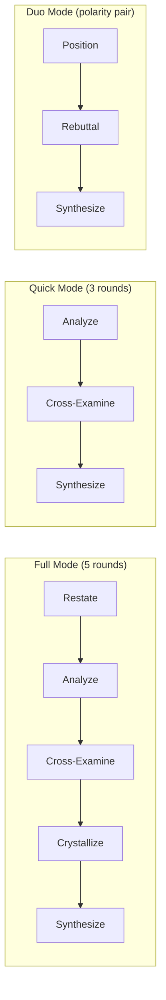

<p align="center">
  <strong>Council of Minds</strong><br/>
  <em>Multi-advisor deliberation for AI agents. One council, every coding client.</em>
</p>

<p align="center">
  
  
  
  
  
</p>

<p align="center">
  <a href="#install"><strong>Install</strong></a> ·
  <a href="#how-it-works"><strong>How It Works</strong></a> ·
  <a href="#the-18-advisors"><strong>Advisors</strong></a> ·
  <a href="#vs-alternatives"><strong>vs Alternatives</strong></a> ·
  <a href="#inspiration"><strong>Inspiration</strong></a>
</p>

<p align="center">
  <a href="docs/architecture.md"></a>
  <a href="docs/advisors.md"></a>
  <a href="docs/profiles.md"></a>
  <a href="docs/examples.md"></a>
</p>

---

## Why Council of Minds?

> [!IMPORTANT]
> You ask one AI a question, you get one answer. That answer might be great. It might be mid. You have no way to tell because you saw **one perspective**. The council fixes this.

Decisions with genuine uncertainty — architecture choices, product pivots, technology bets, strategic moves — deserve more than a single-shot response from one model. Council of Minds runs your question through **5-7 independent advisors**, each thinking from a fundamentally different angle, then has them **peer-review each other anonymously**, and synthesizes everything into a **verdict with confidence scoring**.

| Problem | What happens without a council |
|:--------|:------|
| **Single-perspective blindness** | Your AI optimizes for one angle, misses 4 others |
| **Confidence theater** | Every response sounds equally confident regardless of actual certainty |
| **No dissent preservation** | The best counterargument never gets surfaced |
| **No peer pressure** | Without review, weak reasoning goes unchallenged |
| **Generic advice** | Without grounding protocols, responses default to corporate platitudes |

---

## The Solution

Council of Minds convenes 5-7 specialized advisors from a pool of 18, runs them through a 5-round deliberation process, and delivers a structured verdict that tells you where advisors agree, where they clash, and what you should actually do.

```mermaid
graph TB
    User["User<br/>'council this: ...'"] --> S0

    subgraph Orchestrator["Council of Minds"]
        S0["STEP 0: Framing<br/>Parse · scan workspace · select profile<br/>· assign domain-weight (1.5x)"]
        S1["STEP 1: Problem Restate Gate<br/>Each advisor restates in 1 sentence<br/>If 3+ reframe → surface to user"]
        S2["STEP 2: Independent Analysis<br/>5-7 advisors parallel · 300 words<br/>STANCE · CONFIDENCE · DEALBREAKER<br/>· evidence-labeled"]
        S3["STEP 3: Cross-Examination<br/>Disagree · Strengthen · Update<br/>Anti-conformity enforced"]
        S4["STEP 4: Enforcement Scan<br/>Dissent quota · novelty · diversity<br/>· engagement quality"]
        S5["STEP 5: Crystallization<br/>100-word final positions<br/>Declarative · no hedging"]
        S6["STEP 6-7: Vote Tally + Synthesis<br/>Confidence-weighted · 2/3 threshold<br/>Chairman produces verdict"]

        S0 --> S1 --> S2 --> S3 --> S4 --> S5 --> S6
    end

    S6 --> Verdict

    subgraph Verdict["Council Verdict"]
        V1[Vote Tally]
        V2[Consensus]
        V3[Key Insights]
        V4[Disagreements]
        V5[Minority Report]
        V6[Kill Criteria]
        V7[Recommendation]
        V8[Next Step]
    end

    Verdict --> Follow["STEP 8: Follow-Up<br/>expand · challenge · reweight<br/>· re-run · duo · save"]
```



### Three Modes



---

## Install

```bash
./install.sh
```

Auto-detects your AI clients (Kiro, Claude, Cursor, Windsurf, Cline, Aider, RooCode, OpenCode), lets you choose which to install for, and copies everything in native format.

```bash
./install.sh --client kiro --global    # Non-interactive
./install.sh --uninstall               # Remove from all clients
```

See [docs/install.md](docs/) for per-client details and manual install.

---

## Usage

### Trigger Phrases

| Phrase | Effect |
|--------|--------|
| `council this: [question]` | Auto-select profile |
| `engineering council: [question]` | Force engineering advisors |
| `strategy council: [question]` | Force strategy advisors |
| `product council: [question]` | Force product advisors |
| `risk council: [question]` | Force risk advisors |
| `ai council: [question]` | Force AI/ML advisors |
| `innovation council: [question]` | Force innovation advisors |
| `quick council: [question]` | Quick mode (3 rounds, faster) |
| `duo this: [question]` | Duo mode (2 advisors, polarity pair) |
| `war room this` / `pressure-test this` | Same as "council this" |

### Follow-Up Commands

After receiving a verdict:

```
expand on the inverter's point        → deep dive one advisor
challenge the verdict with [new info]  → re-synthesize
weight toward risk                     → reweight emphasis
re-run with strategy profile           → different composition
save transcript                        → save to file
```

### Custom Council

```
council this with architect, tail-watcher, realist, shipper, questioner: [question]
```

---

## Council Profiles

| Profile | Advisors | Best For |
|---------|----------|----------|
| **engineering** | architect · deriver · shipper · systems-mapper · inverter · user-advocate | Architecture, code design, infra |
| **strategy** | strategist · realist · inverter · timer · tail-watcher · systems-mapper | Market, competition, positioning |
| **product** | user-advocate · shipper · realist · bias-hunter · reframer · deriver | Features, UX, direction |
| **risk** | tail-watcher · bias-hunter · inverter · systems-mapper · stoic · strategist | High-stakes, go/no-go |
| **ai-ml** | model-whisperer · frontier-scout · architect · deriver · tail-watcher · shipper | AI products, model choices |
| **innovation** | questioner · subtractor · reframer · taxonomist · deriver · inverter | New spaces, assumptions |

---

## The 18 Advisors

### Technical (`advisors/technical.md`)

| Advisor | Cognitive Function | Inspired By |
|---------|-------------------|-------------|
| **architect** | Formal structure, abstraction boundaries | Ada Lovelace |
| **deriver** | First-principles reconstruction, jargon destruction | Richard Feynman |
| **shipper** | Pragmatic engineering, over-engineering detection | Linus Torvalds |
| **model-whisperer** | ML capability frontiers, build-vs-prompt | Andrej Karpathy |
| **frontier-scout** | Scaling dynamics, capability-safety boundary | Ilya Sutskever |
| **systems-mapper** | Feedback loops, leverage points | Donella Meadows |

### Strategic (`advisors/strategic.md`)

| Advisor | Cognitive Function | Inspired By |
|---------|-------------------|-------------|
| **strategist** | Terrain reading, adversarial dynamics | Sun Tzu |
| **realist** | Incentive mapping, power dynamics | Machiavelli |
| **timer** | Strategic timing, momentum reading | Miyamoto Musashi |
| **inverter** | Multi-model inversion, opportunity cost | Charlie Munger |
| **tail-watcher** | Tail risk, antifragile design | Nassim Taleb |
| **taxonomist** | Classification, category errors | Aristotle |

### Wisdom (`advisors/wisdom.md`)

| Advisor | Cognitive Function | Inspired By |
|---------|-------------------|-------------|
| **questioner** | Assumption destruction, dialectic | Socrates |
| **subtractor** | Via negativa, minimum intervention | Lao Tzu |
| **reframer** | Frame dissolution, false dichotomies | Alan Watts |
| **stoic** | Control boundaries, moral clarity | Marcus Aurelius |
| **bias-hunter** | Cognitive bias detection, pre-mortems | Daniel Kahneman |
| **user-advocate** | User experience, design honesty | Dieter Rams |

---

## vs Alternatives

| Feature | Council of Minds | [LLM Council](https://github.com/aiwithremy/claude-skills-llm-council) (Remy) | [Council of High Intelligence](https://github.com/0xNyk/council-of-high-intelligence) (0xNyk) |
|---------|:---:|:---:|:---:|
| **Advisors** | 18 cognitive lenses | 5 generic thinking styles | 18 named personas |
| **Modes** | Full (5-round) · Quick (3-round) · Duo | Single mode only | Full · Quick · Duo |
| **Profile-based selection** | 6 profiles + auto-select + custom | None — always all 5 | Triads + profiles (manual) |
| **Problem Restate Gate** | Yes — catches wrong questions | No | No |
| **Evidence labeling** | Required (empirical/mechanistic/strategic/ethical/heuristic) | No | Yes |
| **Cross-examination** | Structured Disagree/Strengthen/Update | Free-form "strongest/weakest" | Round 2 structured engagement |
| **Anti-conformity directive** | Explicit — must name flaw to update | No | No |
| **Enforcement scan** | Dissent quota + novelty + diversity + engagement | No | Yes (similar) |
| **Vote tally** | Confidence-weighted with 2/3 threshold | No | Yes (weighted) |
| **Domain-weight seat** | 1.5x for most-relevant advisor | No | Yes |
| **Kill Criteria** | Required in every verdict | No | Yes |
| **DEALBREAKER flag** | Per-advisor, chairman must address | No | No |
| **Minority Report** | Explicit section with full reasoning | Mentioned in synthesis | No formal section |
| **Acceptable Compromises** | Required section | No | No |
| **Follow-up protocol** | expand · challenge · reweight · re-run · duo | None | None |
| **Agent-agnostic** | Kiro · Cursor · Claude · Windsurf · 8 clients | Claude only | Claude only |
| **Grounding protocols** | Per-advisor with hard constraints | None | Per-advisor |
| **Polarity pairs** | 10 defined tension pairs for Duo mode | N/A | Yes |

### Why Ours Is Better

1. **5-round deliberation with enforcement.** Not just "ask 5 advisors and summarize." Problem Restate Gate catches wrong questions. Cross-examination forces direct engagement. Enforcement scan rejects lazy agreement. Crystallization produces clean inputs for synthesis.

2. **Confidence-weighted vote tally.** Auditable math, not vibes. Domain-weight seat (1.5x) ensures the most-relevant advisor has proportional influence. 2/3 threshold means split decisions are reported as splits, not forced consensus.

3. **Kill Criteria + Acceptable Compromises.** Every verdict states when it expires and what it gives up. Neither alternative forces this honesty.

4. **Anti-conformity directive.** Must name the specific flaw to update position. Prevents the groupthink collapse that ruins most multi-agent deliberations.

5. **3 modes for 3 situations.** Full (complex decisions), Quick (time-sensitive), Duo (binary choices with polarity pairs). Neither alternative adapts process to decision weight.

6. **Agent-agnostic with install script.** Works on Kiro, Claude, Cursor, Windsurf, Cline, Aider, RooCode, OpenCode. Auto-detects and installs in native format. Not locked to one client.

---

## How It Works

| Step | What happens |
|:----:|---|
| 0 | User triggers council — orchestrator parses question, scans workspace, selects profile |
| 1 | **Problem Restate Gate** — each advisor restates in their lens (catches wrong questions) |
| 2 | **Independent Analysis** — 5-7 advisors spawn in parallel, 300 words each, evidence-labeled |
| 3 | **Cross-Examination** — structured Disagree/Strengthen/Update with anti-conformity directive |
| 4 | **Enforcement Scan** — verify dissent quota, novelty, evidence diversity, engagement quality |
| 5 | **Crystallization** — 100-word final declarative positions with STANCE/CONFIDENCE/DEALBREAKER |
| 6 | **Vote Tally** — confidence-weighted scoring with domain-weight seat (1.5x), 2/3 threshold |
| 7 | **Chairman Synthesis** — verdict with Kill Criteria, Compromises, Minority Report, Next Step |
| 8 | **Follow-Up** — expand, challenge, reweight, re-run, duo, save transcript |

---

## When to Use

**Good council questions:**
- Architecture decisions with multiple valid approaches
- Product pivots or major feature bets
- Hire vs build vs buy decisions
- Risk assessment before irreversible actions
- Strategic positioning against competitors
- Technology selection with long-term consequences
- "Should I X or Y?" with genuine stakes

**Do NOT council:**
- Factual lookups ("what version of Node supports X?")
- Simple yes/no without tradeoffs
- Creation tasks ("write me a function")
- Questions with one right answer

---

## Documentation

| | |
|:--|:--|
| <a href="docs/architecture.md"></a> | [System design, mermaid diagrams, phase flow, anonymization, design decisions](docs/architecture.md) |
| <a href="docs/advisors.md"></a> | [All 18 advisors — function, method, grounding protocol, blind spots](docs/advisors.md) |
| <a href="docs/profiles.md"></a> | [6 profiles, auto-selection logic, custom profiles, tips](docs/profiles.md) |
| <a href="docs/examples.md"></a> | [Full input/output examples from real council sessions](docs/examples.md) |

---

## Project Structure

```
council-of-minds/
├── install.sh                        # Auto-detect + install for all clients
├── council-of-minds.json             # Agent config (Kiro native)
├── council-of-minds.md               # Orchestrator prompt (universal)
├── advisors/
│   ├── technical.md                  # 6 engineering/AI advisors
│   ├── strategic.md                  # 6 strategy/risk advisors
│   └── wisdom.md                     # 6 philosophy/design advisors
├── docs/
│   ├── architecture.md               # System design + mermaid diagrams
│   ├── advisors.md                   # Full 18-advisor reference
│   ├── profiles.md                   # Profile details + auto-selection
│   └── examples.md                   # Input/output examples (real sessions)
├── settings/
│   ├── council-of-minds.config.json  # Profiles, keywords, settings
│   └── council-of-minds.meta.json    # Agent metadata
└── README.md
```

---

## Customization

Edit `council-of-minds.config.json` to:
- Add/modify profiles (custom advisor combinations)
- Adjust keyword mappings for auto-selection
- Change advisor count limits (default: 5-7)
- Toggle anonymization
- Modify word limits per phase

---

## Inspiration

This project synthesizes three approaches to multi-perspective AI deliberation:

**Andrej Karpathy's LLM Council methodology** — The core insight: dispatch the same query to multiple models, have them peer-review each other anonymously, then a chairman produces the final answer. Anonymization prevents deference bias. Implemented via [aiwithremy/claude-skills-llm-council](https://github.com/aiwithremy/claude-skills-llm-council).

**0xNyk's Council of High Intelligence** — 18 deeply characterized intellectual figures (Munger, Feynman, Taleb, Torvalds, etc.) with grounding protocols that prevent persona drift, polarity pairs that create natural tension, and "Where I May Be Wrong" sections that force epistemic humility. [0xNyk/council-of-high-intelligence](https://github.com/0xNyk/council-of-high-intelligence).

**Original contributions** — Profile-based dynamic advisor selection (never run all 18), confidence scoring with consensus meter, explicit dissent preservation, follow-up drilldown protocol (expand/challenge/reweight/re-run), agent-agnostic design (plain markdown works everywhere), and renaming advisors by cognitive function rather than persona to prevent roleplay drift.

---

## Author

<p>
  <a href="https://github.com/BhavanPatel"><strong>Bhavan Patel</strong></a>
</p>

## License

MIT
