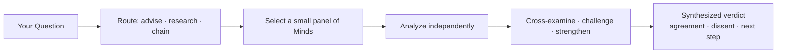

<p align="center">
  <strong>Council of Minds</strong><br/>
  <em>A council of Minds — Researchers investigate, Advisors judge; solo or chained; installable across every AI agent.</em>
</p>

<p align="center">
  
  
  
  
</p>

<p align="center">
  <a href="#what-it-is"><strong>What It Is</strong></a> ·
  <a href="#install"><strong>Install</strong></a> ·
  <a href="#how-it-works"><strong>How It Works</strong></a> ·
  <a href="#the-advisors"><strong>Advisors</strong></a> ·
  <a href="#the-researchers"><strong>Researchers</strong></a> ·
  <a href="#vs-alternatives"><strong>vs Alternatives</strong></a>
</p>

<p align="center">
  <a href="docs/concepts.md"></a>
  <a href="docs/advisors.md"></a>
  <a href="docs/researchers.md"></a>
  <a href="docs/chaining.md"></a>
  <a href="docs/examples.md"></a>
</p>

---

## What It Is

> [!IMPORTANT]
> You ask one AI a question, you get one answer from one angle — and no way to tell whether it is right or just confident. A council of Minds fixes this.

**Council of Minds is a council of Minds.** A **Mind** is a single markdown file with one distinct
perspective. There are two kinds:

| Kind of Mind | You ask… | It does | It returns |
|--------------|----------|---------|------------|
| **Advisor** | what should I **do**? — a choice, tradeoff, judgement | reasons over the topic from its angle, validates it, argues with the others | a **recommendation** with dissent preserved |
| **Researcher** | what **is** true? — the state of the world, a claim, current facts | retrieves external evidence — the internet, sources, data | a **well-sourced answer** with per-claim confidence and falsifiers |

Advisors **think**; Researchers **look**. They work three ways:

- **Advisors alone** — reason to a recommendation.
- **Researchers alone** — retrieve a sourced answer.
- **Chained** — researchers first, then advisors reason over the findings, for *"what should we do,
  given the current landscape?"* The recommendation cites the evidence it rests on, and dissent is
  preserved at both layers.

An orchestrator picks a small panel of Minds for each question, runs them through a structured
process — independent analysis, peer cross-examination, then a synthesized verdict — and tells you
where they agree, where they clash, and what the strongest dissent is. **The disagreement is the
product.**


```mermaid
graph LR
    Q["Your Question"] --> Route["Route: advise · research · chain"]
    Route --> Panel["Select a small panel of Minds"]
    Panel --> Work["Analyze independently"]
    Work --> Cross["Cross-examine · challenge · strengthen"]
    Cross --> Verdict["Synthesized verdict<br/>agreement · dissent · next step"]
```

New here? Start with [docs/concepts.md](docs/concepts.md).

---

## Install

```bash
# Step 1: Setup (clones repo + installs CLI)
curl -sL https://raw.githubusercontent.com/BhavanPatel/council-of-minds/main/setup.sh | bash

# Step 2: Install for your AI clients
council install
```

Auto-detects your AI clients (Kiro, Claude, Cursor, Windsurf, Cline, Aider, RooCode, OpenCode, GitHub Copilot, Codex), lets you choose which to install for, and copies everything in native format.

> Client install differs by design: config-bearing clients (Kiro, Claude, Cursor, Windsurf, Aider, OpenCode) get the advisors, researchers, and all three config files; Cline and RooCode are rules-only (no config files); GitHub Copilot and Codex inline only the self-contained orchestrator (`council-of-minds.md`). This is intentional, not a partial install.

```bash
# If already installed, use the CLI directly
council install --client claude
```

### CLI Commands

After install, the `council` command is available globally:

```bash
council install      # Install/reinstall for detected AI clients
council status       # Show what's installed and for which clients
council update       # Pull latest from git + reinstall
council disable      # Temporarily disable (reversible)
council enable       # Re-enable
council uninstall    # Remove from all clients
council version      # Show version
```

### Manual Install

```bash
git clone https://github.com/BhavanPatel/council-of-minds.git ~/.council-of-minds
cd ~/.council-of-minds && ./install.sh
```

---

## Usage

### Basic — Just Ask

```
council this: Should we migrate to event-driven architecture or stay with REST?
```

### Better — Add Context for Better Results

```
engineering council: Should we migrate to event-driven architecture or stay with REST?

Context: 4 microservices, team of 8, current REST latency is 200ms p95, 
we need sub-50ms for the real-time feed. Team has no Kafka experience. 
Deadline: Q4 launch.
```

### Best — Specify Stakes and Constraints

```
risk council: Should we accept the acquisition offer or continue independently?

Context: $12M offer, 18 months runway remaining, $800K MRR growing 15% MoM.
Two competitors just raised Series B. Team of 22, 3 key engineers have 
retention risk. Board is split.

Stakes: Irreversible. If we decline and miss the growth window, no second offer.
Constraints: Need decision by end of month. No bridge financing available.
```

### Quick Decisions

```
quick council: Should we rollback this deploy? 2% error rate, 47 files changed.
```

### Binary Choices

```
duo this: PostgreSQL or DynamoDB for our event store?
Context: 50K writes/sec, team knows Postgres, AWS infrastructure.
```

### Follow-Up After Verdict

```
expand on the tail-watcher's point
challenge the verdict with: our CTO insists on team autonomy per service
weight toward risk
re-run with innovation profile
```

### Tips for Better Council Sessions

| Do | Dont |
|----|------|
| Provide context (team size, constraints, timeline) | Ask vague questions ("should I improve things?") |
| State what is irreversible or high-stakes | Ask factual questions with one right answer |
| Name the options you are choosing between | Ask the council to write code or create content |
| Specify the profile if you know the domain | Trigger on trivial decisions |
| Use `duo` for quick binary choices | Use `full` for time-sensitive incidents |

See [docs/examples.md](docs/examples.md) for complete input/output examples.

---

## Council Profiles

A **profile** is a named panel of advisors tuned for a domain. The table below is an abbreviated
map; the canonical rosters, the "why these advisors" rationale, and auto-selection live in
[docs/advisors.md](docs/advisors.md) and
[`settings/decision-council.config.json`](settings/decision-council.config.json).

| Profile | Advisors | Best For |
|---------|----------|----------|
| **engineering** | architect · deriver · shipper · systems-mapper · inverter | Architecture, code design, infra |
| **strategy** | strategist · realist · inverter · timer · tail-watcher | Market, competition, positioning |
| **product** | user-advocate · shipper · realist · bias-hunter · reframer | Features, UX, direction |
| **risk** | tail-watcher · bias-hunter · inverter · systems-mapper · stoic | High-stakes, go/no-go |
| **ai-ml** | model-whisperer · frontier-scout · architect · deriver · tail-watcher | AI products, model choices |
| **innovation** | questioner · subtractor · reframer · taxonomist · inverter | New spaces, assumptions |
| **creative** | ideator · synthesizer · narrator · provocateur · aesthete | Brainstorming, naming, brand |
| **people** | empath · culture-reader · negotiator · motivator · devil's-advocate | Hiring, teams, conflict |
| **finance** | financier · data-analyst · strategist · tail-watcher · realist | Investment, pricing, economics |
| **legal** | legalist · stoic · bias-hunter · historian · diplomat | Compliance, contracts, liability |
| **science** | scientist · data-analyst · deriver · devil's-advocate · frontier-scout | Research, evidence, experiments |
| **operations** | operator · systems-mapper · shipper · timer · diplomat | Logistics, execution, delivery |
| **truth** | epistemologist · source-critic · bayesian · bias-hunter · integrator | Evidence evaluation, claims |
| **research** | scientist · bayesian · source-critic · calibrator · data-analyst | Research, methodology |
| **future** | futurist · scenario-planner · pattern-hunter · complexity-navigator · resilience-architect | Trends, scenarios, long-term |
| **learning** | teacher · simplifier · curriculum-designer · assessor · coach | Teaching, content, accessibility |
| **sustainability** | sustainability-engineer · supply-chain-analyst · maker · systems-mapper · futurist | Environmental, circular economics |
| **hardware** | product-designer · spatial-thinker · maker · ergonomist · architect | Physical products, manufacturing |
| **crisis** | empath · strategist · red-teamer · operator · diplomat | Incident response, crisis comms |
| **startup** | ideator · financier · shipper · scenario-planner · user-advocate | Early-stage, PMF, pivots |
| **governance** | epistemologist · legalist · historian · diplomat · culture-reader | Policy, org governance |

---

## The Advisors

Advisors are grouped into **themes**; each theme is one markdown file. A **profile** is a curated
panel of advisors for a domain — name one, or let auto-selection pick. Full roster, profiles, and
selection logic: [docs/advisors.md](docs/advisors.md).

### Technical — Engineering, systems, computation
| Advisor | Lens |
|---------|------|
| **architect** | Formal structure, abstraction boundaries, what can/cannot be mechanized |
| **deriver** | First-principles reconstruction, jargon destruction, simplest explanation |
| **shipper** | Pragmatic engineering, over-engineering detection, maintenance cost |
| **model-whisperer** | ML capability frontiers, training dynamics, build-vs-prompt |
| **frontier-scout** | Scaling dynamics, phase transitions, capability-safety boundary |
| **systems-mapper** | Feedback loops, leverage points, unintended consequences |

### Strategic — Competition, incentives, timing, risk
| Advisor | Lens |
|---------|------|
| **strategist** | Terrain reading, adversarial dynamics, information asymmetry |
| **realist** | Incentive mapping, power dynamics, stated vs revealed preferences |
| **timer** | Strategic timing, momentum reading, when to strike vs wait |
| **inverter** | Multi-model inversion, opportunity cost, failure avoidance |
| **tail-watcher** | Tail risk, fragility audit, antifragile design |
| **taxonomist** | Classification, category errors, precise definitions |

### Wisdom — Assumptions, bias, ethics, framing
| Advisor | Lens |
|---------|------|
| **questioner** | Assumption destruction, dialectic, hidden questions |
| **subtractor** | Via negativa, minimum intervention, emergence |
| **reframer** | Frame dissolution, false dichotomies, perspective shift |
| **stoic** | Control boundaries, moral clarity, resilience |
| **bias-hunter** | Cognitive bias detection, pre-mortems, de-biasing |
| **user-advocate** | User experience, cognitive load, design honesty |

### Creative — Ideation, synthesis, narrative, aesthetics
| Advisor | Lens |
|---------|------|
| **ideator** | Divergent idea generation, possibility space exploration |
| **synthesizer** | Cross-domain pattern integration, structural fusion |
| **narrator** | Story structure, narrative coherence, audience analysis |
| **provocateur** | Creative destruction, sacred-cow slaughter, heresy |
| **aesthete** | Form-function harmony, elegance, design coherence |
| **analogist** | Structural analogy, cross-domain transfer, mapping |

### Human — Empathy, culture, negotiation, motivation
| Advisor | Lens |
|---------|------|
| **empath** | Emotional landscape mapping, unspoken needs, safety |
| **culture-reader** | Organizational dynamics, power structures, incentives |
| **negotiator** | Interest-based bargaining, value creation, BATNA |
| **motivator** | Behavioral activation, choice architecture, habit design |
| **devil's-advocate** | Systematic opposition, steel-man, pre-mortem |
| **historian** | Historical precedent, pattern recognition, base rates |

### Domain — Finance, law, science, operations, data
| Advisor | Lens |
|---------|------|
| **financier** | Quantitative modeling, cash flows, optionality, NPV |
| **legalist** | Regulatory analysis, compliance, liability, safe harbor |
| **scientist** | Hypothesis testing, evidence quality, confounders |
| **operator** | Resource orchestration, bottlenecks, dependencies |
| **diplomat** | Stakeholder alignment, coalitions, communication sequence |
| **data-analyst** | Statistical inference, signal vs noise, uncertainty |

### Epistemic — Truth, evidence, meta-cognition
| Advisor | Lens |
|---------|------|
| **epistemologist** | Knowledge boundaries, category errors, epistemic access |
| **source-critic** | Information provenance, incentive mapping, corroboration |
| **bayesian** | Probabilistic updating, priors, likelihood ratios |
| **red-teamer** | Adversarial simulation, attack surfaces, threat models |
| **calibrator** | Confidence scoring, reference classes, planning fallacy |
| **integrator** | Multi-source synthesis, contradiction resolution, evidence weighting |

### Futurist — Trends, scenarios, emergence, adaptation
| Advisor | Lens |
|---------|------|
| **futurist** | Trend trajectory analysis, inflection points, timing assessment |
| **scenario-planner** | Multi-path simulation, critical uncertainties, no-regret moves |
| **pattern-hunter** | Weak signal detection, peripheral scanning, propagation paths |
| **complexity-navigator** | Emergence recognition, system classification, adaptive strategy |
| **resilience-architect** | Antifragile design, optionality, stress-testing protocols |
| **horizon-scanner** | Peripheral vision, adjacent domains, wild cards, reframe risk |

### Pedagogical — Teaching, explaining, accessibility
| Advisor | Lens |
|---------|------|
| **teacher** | Instructional design, learning objectives, knowledge transfer |
| **simplifier** | Complexity reduction, plain language, essence extraction |
| **curriculum-designer** | Learning path architecture, sequencing, prerequisites |
| **assessor** | Understanding verification, mastery evaluation, feedback loops |
| **coach** | Guided discovery, practice design, growth facilitation |
| **translator** | Audience adaptation, technical-to-lay translation, context bridging |

### Applied — Physical reality, manufacturing, sustainability
| Advisor | Lens |
|---------|------|
| **product-designer** | User-centered physical design, form factor, manufacturing constraints |
| **spatial-thinker** | Dimensional reasoning, layout, geometry, physical arrangement |
| **maker** | Prototype iteration, fabrication, hands-on learning, material constraints |
| **sustainability-engineer** | Lifecycle analysis, circular design, environmental impact |
| **supply-chain-analyst** | Flow optimization, logistics, sourcing, lead times |
| **ergonomist** | Human-system fit, comfort, safety, anthropometrics |

Full advisor details: [docs/advisors.md](docs/advisors.md)

---

## The Researchers

The other kind of Mind. Where advisors reason from prior knowledge, researchers
**retrieve external evidence** and return a cited answer with per-claim
confidence, preserved dissent, and falsifiers. Each researcher owns a source
class + query intent + attack specialisation. Trigger with `research council: ...`,
`sourced council: ...`, or `cite this: ...`.

> **Adversarial evidence auditing** — researchers audit each other's *evidence* (provenance,
> entailment, coverage), not each other's opinions. No retrieval → a labelled prior-knowledge
> briefing, never a faked citation.

### Evidence — Core epistemic retrieval

| Researcher | Query intent | Attack |
|------------|-------------|--------|
| **literature-scout** | mechanism, prior work | "unaware of prior art" |
| **primary-source-hunter** | original wording | "you cited coverage, not the source" |
| **dataset-digger** | magnitudes from raw data | "no underlying data exists" |
| **replication-checker** | does it reproduce | "single-study claim" |
| **meta-analyst** | aggregate consensus | "cherry-picked from a larger body" |
| **citation-tracer** | provenance genealogy | "circular citation loop" |

### Provenance — Who says it, why

| Researcher | Query intent | Attack |
|------------|-------------|--------|
| **source-auditor** | publisher credibility | "low-credibility outlet" |
| **funding-tracer** | conflicts of interest | "funded by an interested party" |
| **author-profiler** | track record | "author has retraction history" |
| **syndication-unmasker** | independence | "same origin — N sources is really 1" |
| **retraction-watch** | validity status | "source has been corrected" |
| **archive-diver** | what changed | "claim was silently edited" |

### Adversarial — Disconfirmation

| Researcher | Query intent | Attack |
|------------|-------------|--------|
| **counter-evidence-scout** | the opposite case | "you never searched for disconfirmation" |
| **null-result-finder** | non-findings | "publication bias" |
| **critic-collector** | published rebuttals | "this was formally rebutted" |
| **failure-case-hunter** | real-world breakdowns | "works in paper, fails in field" |
| **steelman-builder** | strongest opposition | "you attacked the weak version" |
| **fraud-sniffer** | too-good-to-be-true | "data pattern is implausible" |

### Quantitative — The numbers

| Researcher | Query intent | Attack |
|------------|-------------|--------|
| **base-rate-finder** | denominators, priors | "no base rate given" |
| **effect-size-reader** | magnitude vs significance | "significant but trivial" |
| **benchmark-reader** | measured performance | "benchmark contaminated or gamed" |
| **trend-fitter** | rates, inflections | "extrapolated past the data" |
| **cost-modeler** | unit economics | "cost claim unsourced" |
| **uncertainty-quantifier** | error bars, n | "point estimate hides a huge CI" |

### Temporal — Time, recency, staleness

| Researcher | Query intent | Attack |
|------------|-------------|--------|
| **recency-sweeper** | last-N-days frontier | "superseded last month" |
| **timeline-builder** | chronology of the claim | "causality reversed by dates" |
| **precedent-digger** | prior cycles | "this happened before" |
| **version-tracker** | which version | "claim is about an old version" |
| **obsolescence-checker** | what is now stale | "source is dead or stale" |
| **embargo-watcher** | announced-not-shipped | "vaporware treated as shipped" |

### Technical — Implementation reality

| Researcher | Query intent | Attack |
|------------|-------------|--------|
| **code-reader** | implementation reality | "code does not do what docs claim" |
| **spec-reader** | normative definition | "the spec says otherwise" |
| **api-doc-reader** | official limits | "undocumented assumption" |
| **issue-tracker-miner** | known limitations | "known open bug contradicts this" |
| **architecture-mapper** | system shape | "architecture makes this impossible" |
| **reproducer** | does it actually run | "could not reproduce" |

### Market — Commercial reality

| Researcher | Query intent | Attack |
|------------|-------------|--------|
| **competitor-mapper** | who else does this | "novelty claim false — N others exist" |
| **pricing-scout** | published cost | "price is wrong or stale" |
| **adoption-reader** | actual usage | "no evidence of real adoption" |
| **filing-reader** | audited numbers | "contradicted by their own filing" |
| **analyst-reader** | market sizing | "vendor-sponsored analysis" |
| **customer-voice** | lived experience | "users report the opposite" |

### Regulatory — Law and compliance

| Researcher | Query intent | Attack |
|------------|-------------|--------|
| **statute-reader** | what the law says | "misstates the statute" |
| **caselaw-reader** | how it was applied | "precedent contradicts this" |
| **regulator-watcher** | current guidance | "guidance changed" |
| **compliance-mapper** | required controls | "fails a mandatory control" |
| **jurisdiction-comparer** | where it applies | "true in one jurisdiction only" |
| **policy-tracer** | legislative intent | "intent differs from text" |

### Human — Qualitative / social

| Researcher | Query intent | Attack |
|------------|-------------|--------|
| **practitioner-listener** | real usage reports | "practitioners disagree" |
| **expert-canvasser** | expert commentary | "domain experts say otherwise" |
| **sentiment-reader** | aggregate opinion + skew | "sample is self-selected" |
| **ethnographer** | workflow context | "ignores the actual workflow" |
| **dissent-locator** | heterodox positions | "a credible minority view exists" |
| **translation-scout** | non-English record | "anglophone blind spot" |

### Synthesis — Operate on the Source Store

| Researcher | Query intent | Attack |
|------------|-------------|--------|
| **gap-mapper** | what is missing | "no evidence gathered on X" |
| **contradiction-mapper** | what conflicts | "F2 and F7 cannot both hold" |
| **triangulator** | independent confirmation | "not independently confirmed" |
| **claim-normalizer** | dedupe/merge claims | "same claim counted twice" |
| **coverage-auditor** | compliance metrics | "citation coverage below threshold" |
| **brief-writer** | final synthesis | n/a (chairman-equivalent) |

Research profiles are curated panels for common evidence tasks (landscape-scan, claim-verification,
literature-review, technical-due-diligence, market-research, competitive-intel, regulatory-scan,
provenance-audit, incident-forensics, trend-forecast, quantitative-scan, vendor-evaluation,
academic-survey, red-team-research, feasibility-study). Every panel MUST seat ≥1 Synthesis
and ≥1 Adversarial.

Full researcher details, research profiles, the retrieval layer, and the Research Verdict format:
[docs/researchers.md](docs/researchers.md).

**Chaining:** a compound question — *what should I do, given the current
landscape* — runs the researchers first, then feeds their cited Research Verdict into an advisor
panel as the evidence base. The decision verdict carries a `Sourced-From` reference, and dissent is
preserved at **both** layers. Trigger with `chained council: ...`. See
[docs/chaining.md](docs/chaining.md). Research findings are also tracked
**per finding** over time (`researcher scores`, `source reliability`, `research calibration
report`).

---

## vs Alternatives

| Feature | Council of Minds | Deb8flow | Council of Five | CrewAI/AutoGen |
|---------|:---:|:---:|:---:|:---:|
| **Advisors** | cognitive lenses, one file each | 5 (Pro/Con/Mod/Fact/Judge) | 5 governance agents | N (role-based) |
| **Modes** | Full · Quick · Duo · Budget tiers | Single | Single | Task pipelines |
| **Enforcement Scan** | Dissent + novelty + diversity + engagement | No | No | No |
| **Anti-Conformity** | Must name flaw to update | No | No | No |
| **Fact-Checker** | Between rounds, flags disputed claims | Dedicated agent | No | No |
| **Sparse Cross-Exam** | O(N) polarity-pair targeted | N/A (2 debaters) | No | N/A |
| **Early Termination** | Skip crystallization on consensus | No | No | N/A |
| **Cost Budget Mode** | Tiers, auto-configures | No | No | No |
| **Kill Criteria** | Required on every verdict | No | No | No |
| **DEALBREAKER Flag** | Structured veto, chairman must address | No | No | No |
| **Evidence Labeling** | Types required per claim | No | No | No |
| **Domain-Weight Seat** | 1.5x for most-relevant advisor | No | No | No |
| **Debate Analytics** | Position shifts, influence maps, token tracking | No | No | Built-in observability |
| **Confidence-Weighted Vote** | With 2/3 threshold | Judge verdict | Majority | N/A |
| **Problem Restate Gate** | Catches wrong questions | No | No | No |
| **Agent-Agnostic** | Many AI clients | Standalone app | Docker | Python SDK |
| **Profile Selection** | Decision + research profiles + auto-select | Fixed roles | Fixed | Manual crew config |
| **Research-Backed Panel Size** | 4-6 (Google validated) | 5 fixed | 5 fixed | User-defined |
| **Multi-Model Diversity** | Auto-detect + algorithmic assignment | No | No | Manual config |
| **Human-in-the-Loop** | Opt-in checkpoints (inject/remove/redirect/skip) | No | No | No |
| **Confidence Calibration** | Outcome tracking + advisor scoring + calibration report | No | No | No |
| **Researcher Minds** | Retrieval lenses, cited Research Verdict, evidence-gated anti-conformity | Fact agent only | No | Tool calls, no verdict |

### What Makes Us Different

Most multi-agent debate systems fall into one of two traps:

1. **Too simple** — Ask N agents, vote, done. No quality control, no enforcement, conformity bias runs rampant. (Most Claude Code council skills)

2. **Too rigid** — Fixed debate structure, no cost awareness, same heavyweight process for trivial and critical decisions alike. (Deb8flow, Council of Five)

Council of Minds is the **only system** that combines:
- **Quality enforcement** (programmatic validation that rejects lazy agreement)
- **Cost awareness** (6 budget tiers that auto-configure the entire deliberation)
- **Adaptive process** (early termination, sparse cross-exam, mode selection)
- **Structured accountability** (DEALBREAKER veto, Kill Criteria, evidence labeling)

Backed by research: Google's 2025 study of 180 agent configurations, ACL 2026 findings on debate effectiveness, and convergent market evidence from 25+ independent implementations.

### Why Ours Is Better — Competitive Advantages

We researched 25+ competing projects (AutoGen, CrewAI, LangGraph debate patterns, WISE, ReConcile, Deb8flow, Council of Five, and academic papers from 2024-2026). Here's what sets Council of Minds apart:

1. **Enforcement Scan (unique).** We're the ONLY project that programmatically validates: dissent quota, novelty gate, evidence diversity, and engagement quality. Every other system allows lazy consensus.

2. **Anti-Conformity Directive.** Advisors can ONLY update their position when a specific flaw is named. Research (ACL 2026) confirms homogeneous agents with uniform belief updates cannot improve outcomes — our directive is the structural fix.

3. **Fact-Checker Mechanism.** Claims are scanned and flagged (verified/unverifiable/disputed) before cross-examination. No other council system does this.

4. **Sparse Cross-Examination.** O(N) instead of O(N²). Uses polarity pairs + evidence-type diversity for targeted engagement. Better quality, 40-60% fewer tokens.

5. **Adaptive Early Termination.** Skips crystallization when consensus is strong — saves 30-40% tokens without losing verdict quality. Budget-aware.

6. **Cost Budget Mode.** Tiers from a lightweight Duo run to unlimited (Full + all-pairs). Auto-configures panel size, mode, and cross-exam style within budget.

7. **Domain-Weight Seat + DEALBREAKER flag.** Most-relevant advisor gets 1.5x weight. Any advisor can flag a fatal flaw that the chairman MUST address. No competitor has structured veto mechanisms.

8. **Kill Criteria.** Every verdict states when it expires. No other project requires observable falsification conditions.

9. **Evidence Type Labeling.** Every claim is tagged (empirical/mechanistic/strategic/ethical/heuristic). Creates a meta-reasoning layer enabling diversity audits.

10. **Debate Analytics.** Track position changes, who convinces whom, enforcement pass/fail rates, token efficiency. Learn which advisors work best for which domains.

11. **Multi-Model Diversity.** Auto-detects available model backends and algorithmically assigns different models per evidence-type cluster. Falls back to reasoning-variation directives on single-model clients. Zero config required.

12. **Human-in-the-Loop.** Opt-in interactive checkpoints after each round. Inject context, remove advisors, redirect the question, or skip to verdict mid-deliberation. Non-interactive by default — zero overhead unless triggered.

13. **Confidence Calibration.** Track verdict outcomes over time. Log feedback ("council feedback: good/bad/mixed"), generate calibration reports comparing predicted confidence vs actual results, and score individual advisor alignment rates. No competitor offers outcome-based learning.

> Research-backed panel size: Our 4-6 default is validated by Google's "Towards a Science of Scaling Agent Systems" (2025) which tested 180 configurations and found that more agents often hits a ceiling or degrades performance by 39-70% when misaligned with task structure.

---

## How It Works

The table below is the **advisor** deliberation flow (a decision run). Researchers follow a parallel
retrieve → fact-check → cross-exam → per-claim-vote flow (see [docs/researchers.md](docs/researchers.md)),
and a chained run does research first, then this: see [docs/chaining.md](docs/chaining.md).

| Step | What happens |
|:----:|---|
| 0 | User triggers council — orchestrator parses question, scans workspace, selects profile, assigns model diversity |
| 1 | **Problem Restate Gate** — each advisor restates in their lens (catches wrong questions) |
| 2 | **Independent Analysis** — 4-6 advisors spawn in parallel, 300 words each, evidence-labeled. *Interactive: checkpoint here* |
| 3 | **Fact-Check** — claims scanned for verification; disputed/unverifiable flagged for Round 2 |
| 4 | **Cross-Examination** — structured Disagree/Strengthen/Update with sparse engagement targeting. *Interactive: checkpoint here* |
| 5 | **Enforcement Scan** — verify dissent quota, novelty, evidence diversity, engagement quality |
| 5b | **Early Termination Check** — if strong consensus + high confidence, skip crystallization |
| 6 | **Crystallization** — 100-word final declarative positions with STANCE/CONFIDENCE/DEALBREAKER |
| 6 | **Vote Tally** — confidence-weighted scoring with domain-weight seat (1.5x), 2/3 threshold |
| 7 | **Chairman Synthesis** — verdict with Kill Criteria, Compromises, Minority Report, Next Step |
| 8 | **Follow-Up** — expand, challenge, reweight, re-run, duo, save transcript, feedback, calibration report |

---

## When to Use

**Ask the advisors ("what should I do?") for:**
- Architecture decisions with multiple valid approaches
- Product pivots or major feature bets
- Hire vs build vs buy decisions
- Risk assessment before irreversible actions
- Strategic positioning against competitors
- Technology selection with long-term consequences
- "Should I X or Y?" with genuine stakes

**Ask the researchers ("what is true?") for:**
- Verifying a claim against independent sources ("is it true that…?")
- Mapping what exists in a space right now (landscape / competitive scan)
- Current pricing, adoption, or regulatory state
- Due diligence on whether software does what it claims
- Any question whose answer depends on current, contested, or citable facts

**Chain them ("what should I do, given the current landscape?")** when the decision depends on facts
you need retrieved first.

**Do NOT council:**
- Simple factual lookups with one right answer (ask directly, or a single researcher)
- Simple yes/no without tradeoffs
- Creation tasks ("write me a function")

---

## Documentation

| | |
|:--|:--|
| <a href="docs/concepts.md"></a> | [What a Mind is, the two kinds, solo vs chained, the install model](docs/concepts.md) |
| <a href="docs/advisors.md"></a> | [The advisors — function, method, grounding protocol, blind spots, profiles](docs/advisors.md) |
| <a href="docs/researchers.md"></a> | [The researchers — source class, query intent, attack, retrieval layer, verdict, Territory Matrix](docs/researchers.md) |
| <a href="docs/chaining.md"></a> | [Research → Decision chaining: hand-off, re-entry, dual dissent](docs/chaining.md) |
| <a href="docs/architecture.md"></a> | [System design, mermaid diagrams, round flow, design decisions](docs/architecture.md) |
| <a href="docs/examples.md"></a> | [Decision, research, and chained worked examples](docs/examples.md) |
| <a href="docs/comparison.md"></a> | [Council of Minds vs the multi-agent / deep-research landscape](docs/comparison.md) |

---

## Customization

Edit `decision-council.config.json` (installed in your client's settings directory) to:
- Add custom profiles with your own advisor combinations
- Adjust keyword mappings for auto-selection
- Tune the advisor roster and polarity pairs

Router and cross-cutting behaviour (modes, cost budget tiers, fact-checker, early termination,
sparse cross-exam, voting weights, consensus threshold) live in `council-of-minds.config.json`;
the researcher roster and research profiles live in `research-council.config.json`.

### Custom Advisors

Extend the advisor pool with your own, using a cast-agnostic markdown scaffold:

```bash
council advisor create risk-quant     # scaffold advisors/custom/risk-quant.md
council advisor validate risk-quant    # structural check
council advisor list                   # list custom advisors
```

Fill in the template, validate, and reinstall. Valid custom advisors join auto-selection
and any profile under the same panel-size, dissent-quota, and evidence-diversity rules as
built-in advisors. Tool-neutral, no runtime. See `advisors/custom/README.md`.

### Custom Researchers

Extend the researcher pool the same way, using the researcher-cast scaffold:

```bash
council researcher create billing-telemetry     # scaffold researchers/custom/billing-telemetry.md
council researcher validate billing-telemetry    # structural check
council researcher list                          # list custom researchers
```

A custom researcher owns a source class + query intent (territory exclusivity) and obeys the
same ≥1 Synthesis + ≥1 Adversarial seat rule and 4–6 (up to 8 deep) panel limits. Tool-neutral,
no runtime. See `researchers/custom/README.md`. Other research features: opt-in interactive
checkpoints (`interactive research council: ...`), research transcript + Source Store persistence,
a multimodal retrieval lens, and self-benchmark against the DeepResearch Bench format.

### Meta-Governance (the council governs itself)

Ask the council to deliberate on its own rules:

```
council meta: should we lower the consensus threshold to 60%?
```

A fixed epistemic panel (epistemologist, calibrator, questioner, architect, historian)
decides at a **>80% supermajority**. It is **advisory-only**: proposals are logged to
`governance-log.json` and you apply changes manually. Use `show governance history` and
`revert rule change [id]` to audit and undo.

---

## Inspiration & Research Foundation

This project synthesizes three original approaches plus extensive 2025-2026 research:

**Andrej Karpathy's LLM Council methodology** — The core insight: dispatch the same query to multiple models, have them peer-review each other, then a chairman produces the final answer. Prevents deference bias.

**0xNyk's Council of High Intelligence** — 18 deeply characterized intellectual figures with grounding protocols, polarity pairs for natural tension, and "Where I May Be Wrong" sections forcing epistemic humility. [0xNyk/council-of-high-intelligence](https://github.com/0xNyk/council-of-high-intelligence).

**2025-2026 Multi-Agent Debate Research** — Our design is informed by:
- Google's "Towards a Science of Scaling Agent Systems" (180 configurations, optimal panel sizing)
- ReConcile: confidence-weighted consensus among diverse LLMs
- WISE (MERL): Weighted Iterative Society-of-Experts with Solver/Reflector partitioning
- ACL 2026 findings on debate effectiveness and conformity prevention
- "Voting or Consensus?" paper on decision protocol optimization
- Sparse communication topology research (arxiv 2406.11776)

**Original contributions:**
- Profile-based dynamic advisor selection (never run the whole pool)
- Enforcement scan with programmatic quality validation (unique — no competitor has this)
- Adaptive early termination and sparse cross-examination for cost efficiency
- Cost budget mode with auto-configuring tiers
- Fact-checker mechanism for claim verification between rounds
- Debate analytics for continuous improvement
- DEALBREAKER veto mechanism with chairman accountability
- Evidence type labeling creating a meta-reasoning audit layer
- Agent-agnostic design working across many AI coding clients
- Naming advisors by cognitive function rather than persona to prevent roleplay drift

See [docs/comparison.md](docs/comparison.md) for the full competitive landscape analysis.

---

## Author

<p>
  <a href="https://github.com/BhavanPatel"><strong>Bhavan Patel</strong></a>
</p>

## License

MIT
