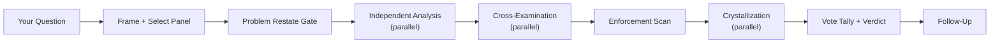
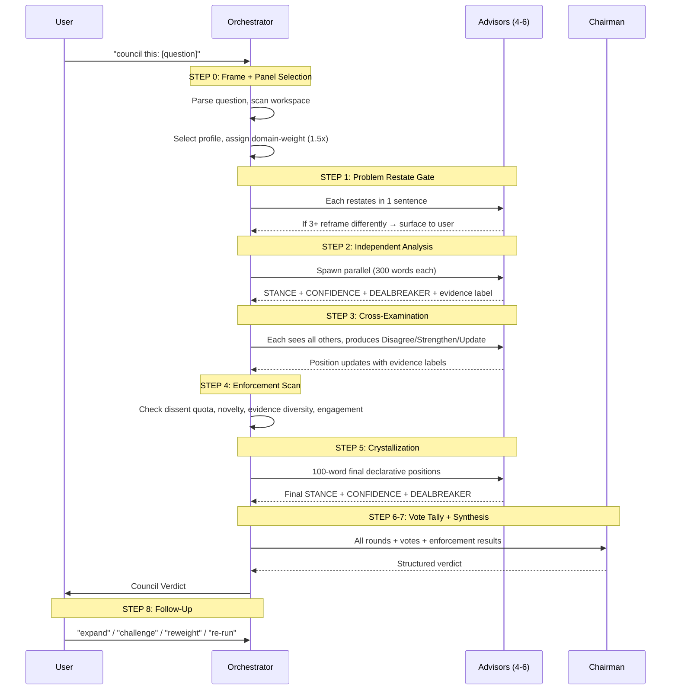
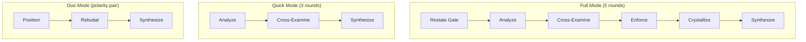
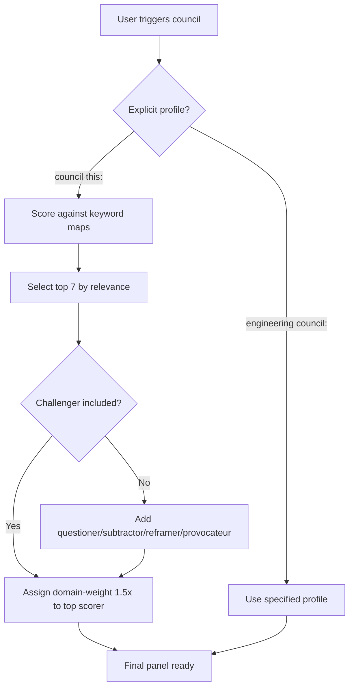
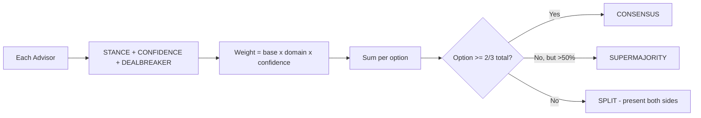
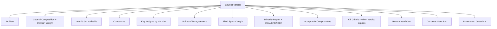
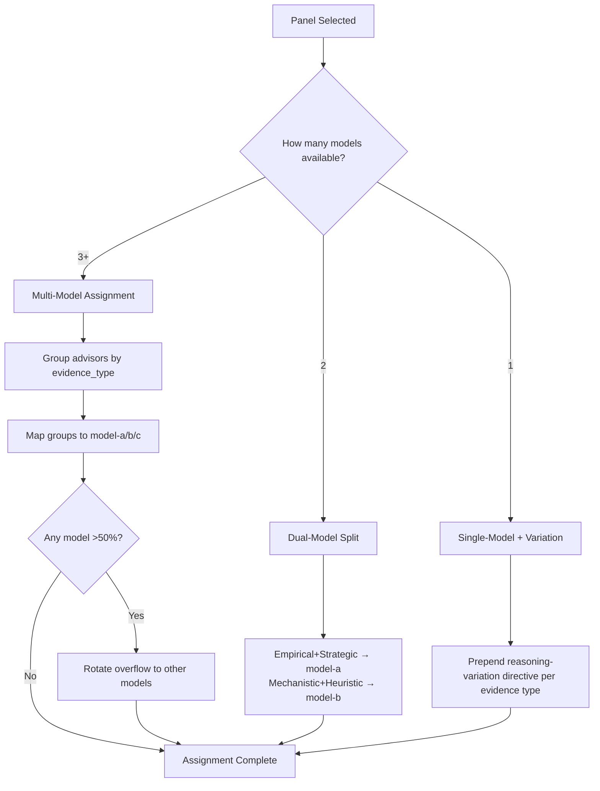
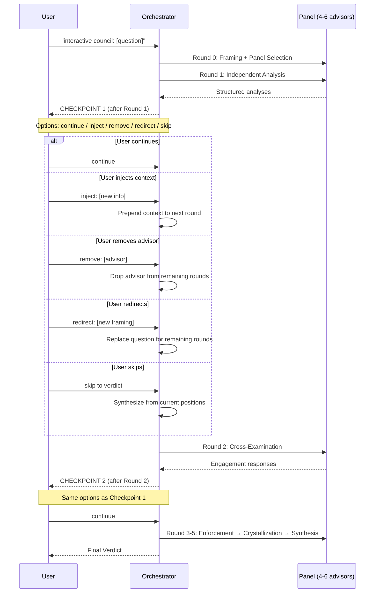

# Architecture

Council of Minds uses an **Orchestrator + Parallel Subagents** pattern with a 5-round deliberation protocol, structured cross-examination, enforcement scanning, and confidence-weighted voting.

---

## How It Works



---

## Full Process (8 Steps)



---

## Three Modes



| Mode | When to Use | Rounds | Panel |
|------|-------------|--------|-------|
| **Full** | Complex decisions with genuine uncertainty | 5 | 4-6 advisors |
| **Quick** | Time-sensitive, lower stakes | 3 | 4-6 advisors |
| **Duo** | Binary choice, rapid opposing views | 3 | 2 (polarity pair) |

---

## Profile Selection



---

## Cross-Examination (Not Anonymized)

Advisors see each other's names during cross-examination. This enables direct engagement with specific claims:

```
### Disagree: {member name}
{Their specific claim + why it fails}

### Strengthened by: {member name}
{Their insight that improves my position}

### Position Update
{What changed and what held — must name the flaw if updating}

### Evidence Label
{empirical | mechanistic | strategic | ethical | heuristic}
```

**Anti-conformity directive:** Position updates ONLY allowed when the advisor can name a specific flaw exposed by another member. "I changed my mind because peers disagree" is rejected.

---

## Enforcement Scan

Before crystallization, the orchestrator verifies quality:

| Check | Pass Criteria | On Fail |
|-------|---------------|---------|
| Dissent quota | At least 2 genuinely different positions | Prompt re-examination |
| Novelty gate | Each Round 2 has content not in Round 1 | Request revision |
| Evidence diversity | Not >80% same evidence type | Flag "reasoning monoculture" |
| Engagement quality | Each advisor cited a specific peer claim | Request deeper engagement |

---

## Vote Tally



**Weight formula:**
- Base: 1.0 (all advisors)
- Domain seat: x1.5 (one per session)
- Confidence: high = x1.0, medium = x0.75, low = x0.5

---

## Verdict Structure



---

## Multi-Model Diversity

The system auto-detects available model backends and assigns different models to different evidence-type groups for genuine reasoning diversity.



| Mode | Condition | What happens |
|------|-----------|-------------|
| **Multi-model** | 3+ models detected | Each evidence-type cluster gets a different backend |
| **Dual-model** | 2 models detected | Split by complementary reasoning styles |
| **Single-model varied** | 1 model (most common) | Reasoning-variation directives create cognitive diversity |

**Key principle:** Zero config required. Auto-detects and maximizes diversity with whatever is available. Users CAN override with explicit model mapping in config.

---

## Interactive Mode (Human-in-the-Loop)

Opt-in checkpoints that pause deliberation after Round 1 and Round 2, allowing user intervention mid-session.

### Sequence Diagram



### Action Effects

| Action | Effect | Scope |
|--------|--------|-------|
| `continue` | No change, proceed normally | Default — zero overhead |
| `inject: {context}` | New info prepended to all remaining prompts | Affects all subsequent rounds |
| `remove: {advisor}` | Advisor produces no further output; prior contributions remain | Panel size decreases by 1 |
| `redirect: {question}` | Original question replaced for remaining rounds | Previous rounds still inform synthesis |
| `skip to verdict` | Chairman synthesizes immediately | Verdict notes early exit |

---

## Key Design Decisions

| Decision | Choice | Why |
|----------|--------|-----|
| Named cross-examination | Direct engagement with specific claims | "The shipper's argument ignores X" is more useful than "Response B is weak" |
| Anti-conformity directive | Must name flaw to update | Prevents groupthink collapse from social pressure |
| Enforcement scan | Quality gate before crystallization | Catches lazy agreement and reasoning monoculture |
| Domain-weight seat (1.5x) | One advisor weighted higher | Equal weighting is dishonest when one lens is clearly most relevant |
| Kill Criteria required | Every verdict states expiration conditions | Prevents false permanence — decisions change when facts change |
| DEALBREAKER flag | Advisors can flag fatal-flaw arguments | Chairman MUST address — cannot be buried in synthesis |
| Confidence weighting | high/med/low maps to 1.0/0.75/0.5 | Low-confidence votes count less — honest uncertainty in tally |
| Crystallization round | 100-word final positions after cross-exam | Produces clean, unambiguous inputs for chairman |
| Multi-model auto-assignment | Evidence-type → model mapping with auto-detect | Same-model panels produce correlated reasoning errors; diversity of backend creates genuine cognitive diversity |
| Interactive mode opt-in | Checkpoints only when triggered, continue is default | Most users want fast verdicts; intervention is for high-stakes sessions where mid-course correction matters |

---

## Data Flow Per Step

| Step | Input | Output |
|------|-------|--------|
| 0: Framing | Raw question + workspace | Framed question + panel + domain-weight |
| 1: Restate | Framed question | 4-6 one-sentence restatements (catches wrong questions) |
| 2: Analysis | Framed question + advisor identity | 4-6 structured analyses with STANCE/CONFIDENCE/DEALBREAKER |
| 3: Cross-exam | All Round 1 responses | 4-6 Disagree/Strengthen/Update with evidence labels |
| 4: Enforcement | All Round 2 responses | Pass/fail + revision requests if needed |
| 5: Crystallize | Post-exam positions | 4-6 declarative 100-word final positions |
| 6: Vote tally | All crystallized stances | Weighted option scores + consensus/split determination |
| 7: Synthesis | Everything above | Structured verdict (13 sections) |
| 8: Follow-up | User command + verdict | Expanded analysis / re-synthesis / transcript |
