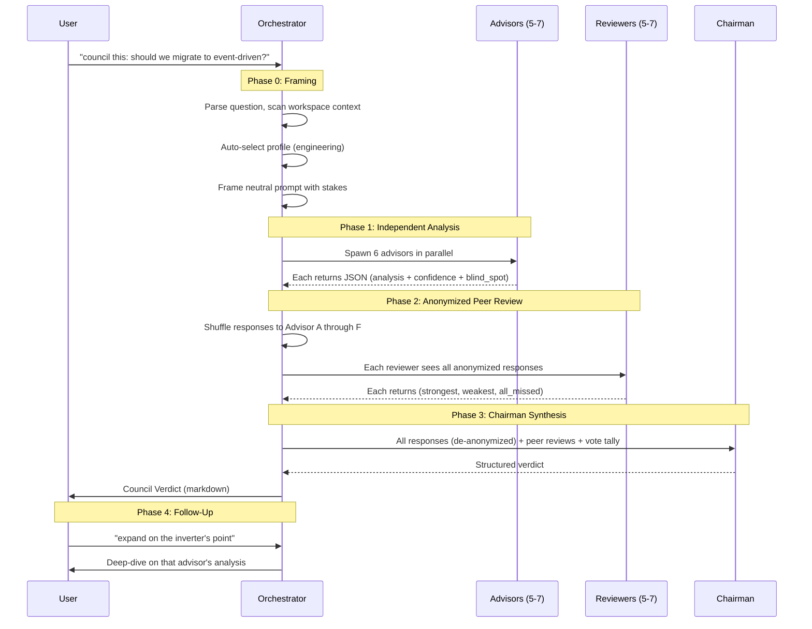
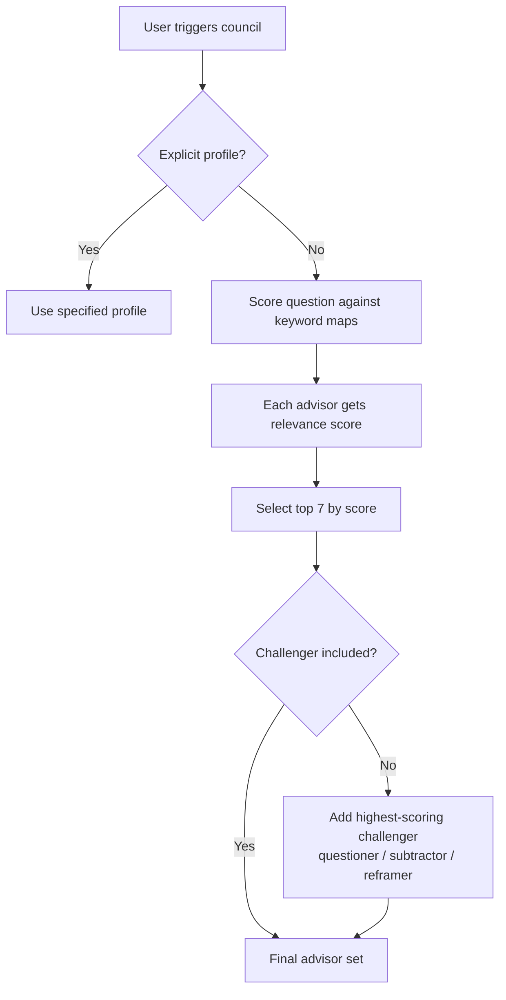
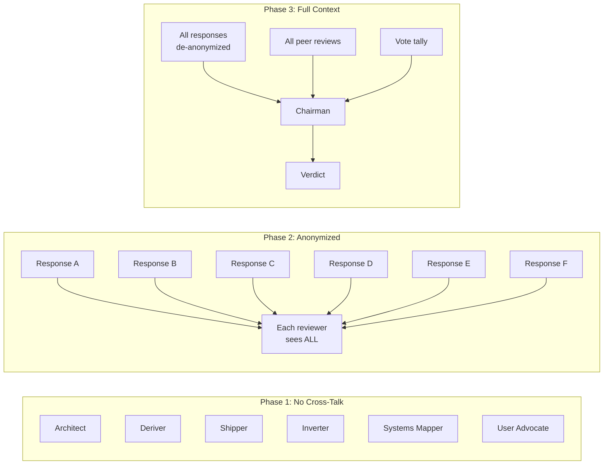
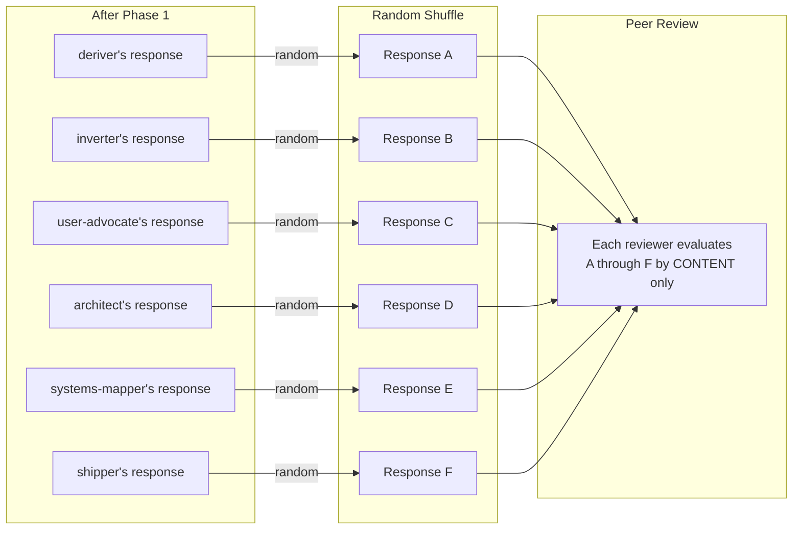
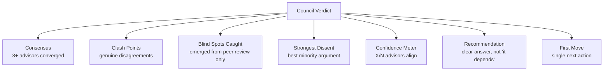

# Architecture

Council of Minds uses an **Orchestrator + Parallel Subagents** pattern — the same architecture used by production multi-agent systems for code review, release readiness, and complex analysis.

---

## System Overview

```mermaid
graph TB
    User[User Input<br/>"council this: ..."] --> Orchestrator

    subgraph Orchestrator["Orchestrator (council-of-minds.md)"]
        Frame[Phase 0: Framing]
        Select[Profile Selection]
        Frame --> Select
    end

    Select --> P1

    subgraph P1["Phase 1: Independent Analysis (parallel)"]
        A1[Advisor 1]
        A2[Advisor 2]
        A3[Advisor 3]
        A4[Advisor 4]
        A5[Advisor 5]
        A6[Advisor 6]
    end

    P1 --> Anon[Anonymize: shuffle to A-F]

    Anon --> P2

    subgraph P2["Phase 2: Peer Review (parallel)"]
        R1[Reviewer 1]
        R2[Reviewer 2]
        R3[Reviewer 3]
        R4[Reviewer 4]
        R5[Reviewer 5]
        R6[Reviewer 6]
    end

    P2 --> P3[Phase 3: Chairman Synthesis]
    P3 --> Verdict[Council Verdict]
    Verdict --> Follow[Phase 4: Follow-Up Protocol]
```

---

## Phase Flow (Detailed)



---

## Profile Selection Logic



---

## Advisor Independence Model



**Key design principle:** Advisors never see each other's work during Phase 1. This prevents anchoring and deference bias — the same reason jury members deliberate before seeing each other's initial votes.

---

## Anonymization Flow



**Why anonymize?** Without it, reviewers defer to "prestigious" advisors. The inverter (inspired by Munger) might get deference votes not because its reasoning is strongest but because of name recognition. Anonymization forces evaluation on merit.

---

## Verdict Structure



---

## Data Flow Per Phase

| Phase | Input | Processing | Output |
|-------|-------|-----------|--------|
| **0: Framing** | Raw question + workspace files | Parse domain, scan context, select profile | Framed question with stakes |
| **1: Analysis** | Framed question + advisor identity | Each advisor applies their method independently | 5-7 structured JSON responses |
| **2: Peer Review** | Anonymized responses (A-G) | Each reviewer evaluates all others | 5-7 review JSONs (strongest, weakest, missed) |
| **3: Synthesis** | De-anonymized responses + reviews + votes | Chairman aggregates and resolves | Structured verdict (markdown) |
| **4: Follow-Up** | Verdict + user command | Expand/challenge/reweight/re-run | Updated analysis |

---

## Design Decisions

| Decision | Choice | Reasoning |
|----------|--------|-----------|
| Parallel vs sequential advisors | **Parallel** | Prevents anchoring — sequential responses bleed into later ones |
| Anonymized peer review | **Yes** | Prevents deference bias to "famous" advisor names |
| Structured JSON output | **Yes** | Enables reliable aggregation and confidence scoring |
| Profile-based selection (5-7) | **Not all 18** | Signal degrades past 7 advisors; profiles optimize relevance |
| Chairman can dissent | **Yes** | Majority isn't always right — strongest reasoning wins |
| Confidence meter | **Quantified (X/N)** | Gives user immediate signal strength without reading full analysis |
| Grounding protocols per advisor | **Yes** | Prevents persona drift and generic responses |
| "Where I May Be Wrong" | **Required per advisor** | Forces epistemic humility before peer review catches blind spots |
